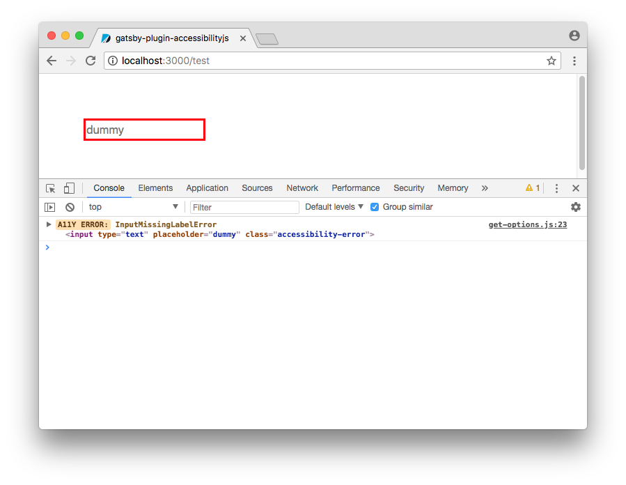

# gatsby-plugin-accessibilityjs

Adds Github's [accessibility.js](https://github.com/github/accessibilityjs) snippet to all rendered pages.



## Install

`yarn add gatsby-plugin-accessibilityjs`

## How to use

```javascript
// in gatsby-config.js
plugins: [`gatsby-plugin-accessibilityjs`];
```

## Options

Defaults: 
```javascript
// in gatsby-config.js
plugins: [
  {
    resolve: `gatsby-plugin-accessibilityjs`,
    options: {
      injectStyles: `
        .accessibility-error {
          border: 3px solid #f00;
        }
      `,
      errorClassName: `accessibility-error`,
      onError: (error) => {
        // do something with the error
      },
    },
  },
];
```

### Fancier Styles

```javascript
// in gatsby-config.js
plugins: [
  {
    resolve: `gatsby-plugin-accessibilityjs`,
    options: {
      injectStyles: `
        .accessibility-error {
          box-shadow: 0 0 3px 1px #f00;
          background-color: rgba(255, 0, 0, 0.25);
          position: relative;
        }
        .accessibility-error:before {
          content: "A11Y";
          position: absolute;
          top: 0;
          left: 0;
          color: #fff;
          font-size: 10px;
          background-color: rgba(255, 0, 0, 0.5);
          transform: translateY(-100%);
        }
      `,
    },
  },
];
```

### Just Logging

Don't modify the DOM at all, just log errors with the default `onError` logger.

```javascript
// in gatsby-config.js
plugins: [
  {
    resolve: `gatsby-plugin-accessibilityjs`,
    options: {
      injectStyles: false,
      errorClassName: false,
    },
  },
];
```

